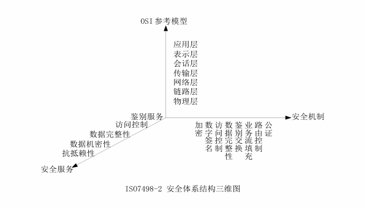

# 人工智能网络安全 2026.9.22上课笔记
## 第一章 信息安全概述
### 1.1 信息安全的理解与威胁
#### 1.1.1 信息与信息安全
- 信息：事物运动的状态与方式
- ISO给出的解释：“信息是通过施加于数据上的某些约定而赋予这些数据的特定含义”
- 通常我们可以把信息、信号、数据、情报和知识等看作信息。信息本身是无形的，借助信息介质以多种形式存在或传播
- 信息安全
- ISO给出的定义：“在技术上和管理上为数据处理系统建立的安全保护，保护信息系统的硬件、软件及相关数据不因偶然或者恶意的原因遭到破坏、更改及泄露”
- 信息安全的目的：“确保以电磁信号为主要形式的、在计算机网络化系统中进行获取、处理、存储、传输和应用的信息内容在各个物理及逻辑区域中的安全存在，并不发生任何侵害行为”
#### 1.1.2 信息安全的发展阶段
- 通信安全 -> 信息安全 -> 信息保障 -> AI安全
1. 通信安全(COMSEC)阶段
20世纪90年代以前，这一阶段的信息安全可以简单称为通信安全，主要目的是保障传递的信息安全，防止信源、信宿以外的对象查看信息  
2. 信息安全(INFOSEC)阶段
20世纪90年代以后，主要保证信息自然具有的安全属性  
三个主要属性：
- 机密性(Confidentiality)指信息只能为授权者使用而不泄露给未经授权者的特性
- 完整性(Integrity)指保证信息在存储和传输过程中未经授权不能被改变的特性
- 可用性(Availability)指保证信息和信息系统随时为授权者提供服务的有效特性
额外的属性：
- 可控性(Controllability)指授权实体可以控制信息系统和信息使用的特性
- 不可否认性(Non-Repudiation)指任何实体均无法否认其实施过的信息行为的特性，也称为抗抵赖性
3. 信息保障时代(IA,Information Assurance)阶段
- 1996年美国人提出了信息保障：
保护(protece)、检测(Detect)、反应(React)、恢复(Restore)四个方面  
我国也对信息保障给出了相关解释：  
“信息保障是对信息和信息系统的安全属性及功能、效率进行保障的动态行为过程。它运用源于人、管理、技术等因素所形成的预警能力、保护能力、检测能力、反应能力、恢复能力和反击能力，在信息和系统生命周期全过程的各个状态下，保证信息内容、计算环境、边界与连接、网络基础设施的真实性、可用性、完整性、保密性、可控性、不可否认性等安全属性，从而保障应用服务的效率和效率，促进信息化的可持续健康发展”
- 信息保障三大要素
1. 人是信息保障的基础
2. 技术是信息保障的核心
3. 管理是信息保障的关键
信息安全不是一个孤立静止的概念，具有相对性，动态性
#### 1.1.3 信息安全威胁的五个基本类型
- 信息泄露：信息被有意或无意泄露给某个非授权的实体
- 信息伪造：某个未授权的实体冒充其他实体发布信息，或者从事其他网络行为
- 完整性破坏：非法手段窃取信息的控制权，未经授权对信息进行修改、插入、删除等操作，使信息内容发生不应有的变化
- 业务否决或拒绝服务：攻击者通过对信息系统进行过量的非法的访问操作使信息系统超载或崩溃，从而无法正常进行业务或提供服务
- 未经授权访问：某个未经授权的实体非法访问信息资源，或者授权实体超越其权限访问信息资源
#### 1.1.4 信息安全威胁的主要表现形式
- 攻击原始资料：人员泄露，废弃的介质，间谍窃取
- 破坏基础设施：破坏电力系统，破坏通讯网络，破坏信息系统场所
- 攻击信息系统：物理侵入，特洛伊木马，恶意访问，服务干扰，旁路控制，计算机病毒
- 攻击信息传输：窃听，业务流分析，重放
- 恶意伪造：业务欺骗，假冒，抵赖
- 自身失误
- 内部攻击

### 1.2 互联网的安全性

#### 1.2.1 互联网发展的现状
- 1983年，ARPA美国高级研究项目管理局和美国国防部通信局研制 TCP/IP 协议，该协议被作为其BSD UNIX的一部分，ARPANET产生
- 1986年，NSF利用Interner Protocol，连接5个科研教育服务机构，建立了NSFnet广域网
- 1987年开始，中国四大网络CSTnet、Cernet、Chinanet、GBnet与Internet直连
- 2007年底，我国互联网用户1.62亿，其中带宽上网用户达到1.22亿，中文网站89.8万个，IPv4地址总数9800多万个，国际出口带宽总量为368927Mbps
- 2018年12月，我国国际出口带宽数达8946570Mbps(8T)
#### 1.2.2互联网的安全现状
- 2000年开始，病毒制造产业化操作，黑色产业链每年的整体利润预计高达数亿元
- 窃取的个人资料
QQ密码、网游密码、银行账号、信用卡账号等任何可以直接或间接转换成金钱的东西，都成为不法分子窃取的对象
- CERT统计  
在1998年安全事件6件，2001年5万件，2003年为13万7千多件，在2003年以后发生呈线性增长  
据CCERT统计，2006年26476件，是2005年9112件的三倍；2018年处理了106000件  
#### 1.2.3 互联网安全事件
- 1988年著名的“Internet蠕虫事件”，使得6000余台计算机的运行受到影响
- 2000年春季，黑客发起分布式拒绝服务攻击(DDoS)大型网站，导致大型ISP服务机构Yahoo网络服务瘫痪
- 2001年8月，“红色代码”蠕虫利用微软web服务器IIS 4.0或5.0中index服务的安全缺陷，在互联网上大规模泛滥
- 2003年，“冲击波”蠕虫的破坏力就更大，据说美国2003年8月份大停电与“冲击波蠕虫”相关
- 2010年，“震网”病毒攻击伊朗核设施
- 2017年5月12日，一种名为Wannacry想哭的勒索病毒袭击全球150多个国际和地区
- 2019年1月6日，逾10款iPhone应用秘密向与Android恶意软件Golduck有关的服务区传输数据
- 2020年5月5日，委内瑞拉国家电网干线遭到攻击，造成全国大面积停电
#### 1.2.4 安全趋势
1. 集团化、产业化的趋势
- 产业链：病毒木马编写者-专业盗号人员-销售渠道-专业玩家及特殊买家
2. “黑客”逐渐变成犯罪职业
- 财富的诱惑，使得黑客袭击不再是一种个人兴趣，而是越来越多的变成一种有组织的、利益趋势的职业犯罪
- 事例：拒绝服务相关的敲诈勒索和“网络钓鱼”
3. 恶意软件的转型
- 恶意软件在行为上将有所改观，病毒化特征削弱，但手段更“高明”，包含更多的钓鱼欺骗元素
4. 网页挂马危害继续延续
- 服务器端系统资源和流量带宽资源大量损失，成为网络木马传播的“帮凶”
- 客户端的用户个人隐私受到威胁
5. 利用应用软件漏洞的攻击将更为迅猛
- 新的漏洞出现要比设备制造商修补的速度更快
- 一些嵌入式系统中的漏洞难以修补
- 零日攻击现象日趋普遍
6. Web2.0的产品将受到挑战
- 以博客、论坛为首的Web2.0产品将成为病毒和网络钓鱼的首要攻击目标
- 社区网站上带有社会工程学性质的欺骗往往超过安全软件所保护的范畴
- 自动邮件发送工具日趋成熟，垃圾邮件制造者正在将目标转向音频和视频垃圾邮件
7. 无线网络、移动手机成为新的安全重灾区，消费者电子设备遭到攻击的可能性增大
- 在无线网络中被传输的信息没有加密或者加密很弱，很容易被窃取、修改和插入，存在较为严重的安全漏洞
- 手机恶意软件、病毒利用普通短信、彩信、上网浏览、下载软件与铃声等方式传播，还将攻击范围扩大到移动网关、wap服务器或其他的网络设备
8. 国家层面的网络安全
#### 1.2.5 网络安全的意义
- 互联网安全不仅影响普通网民的信息和数据的安全性，而且严重的影响国家的健康发展
1. 网络安全与政治安全
2. 网络安全与经济安全
3. 网络安全与军事安全
4. 网络安全与社会稳定
#### 1.2.6 互联网的安全性分析
A. 互联网的设计原始背景  
B. 网络传输的安全性  
C. 信息系统的安全性  
a. 基础网络应用成为黑客及病毒的攻击重点  
b. 系统漏洞带来的安全问题异常突出  
c. Web程序安全漏洞愈演愈烈  
D. 社会工程学攻击越来越多  

### 1.3 信息安全体系结构

#### 1.3.1 面向目标的知识体系结构
机密性-完整性-可用性
CIA三元组：  
- 机密性(Confidentiality)：指信息在存储、传输、使用过程中，不会泄露给非授权用户或实体；
- 完整性(Integrity)：指信息在存储、使用、传输过程中，不会被非授权用户篡改或防止授权用户对信息进行不恰当的篡改
- 可用性(Availability)：指确保授权用户或实体对信息资源的正常使用，不会被异常拒绝，允许其可靠及时地访问信息资源
DAD (Disclosure、Alteration、Destruction)是最普遍的三类风险  
围绕CIA三元组展开的知识体系：  
密码学是三个信息安全目标的技术基础：  
机密性：PGP、VPN、SSL、IPSEC...
完整性：PGP、PKI、数字签名、SSL...
可用性：访问控制、IDS、VPN、病毒防治...
- CIA技术存在着一定程度上的内容交叉
#### 1.3.2 面向应用的层次型技术体系架构
人员：管理安全      顶层
信息：{
        内容安全
        数据安全
      }
系统：{
        运行安全
        物理安全
     }             基础
#### 1.3.3 面向过程的信息安全保障体系
- 信息安全保障是一个完整的动态过程，而保护、检测、反应和恢复可以看作信息安全保障四个子过程
#### 1.3.4 OSI开放系统互连安全体系结构
-   ISO7498-2（1989）《信息处理系统、开放系统互连、基本参考
模型—第2部分：安全体系结构》。描述的开放系统互联安全体
系结构是一个普遍适用的安全体系结构  
  
1. 安全服务（Security Service）
- 鉴别服务确保某个实体身份的可靠性。
- 访问控制确保只有经过授权的实体才能访问受保护的资源。
- 数据机密性确保只有经过授权的实体才能理解受保护的信息。
- 数据完整性防止对数据的未授权修改和破坏。
- 抗抵赖性 用于防止对数据源以及数据提交的否认。
2. 安全机制（Security Mechanism）
- 加密 用于保护数据的机密性。
- 数字签名 保证数据完整性及不可否认性的一种重要手段。
- 访问控制 访问实体成功通过认证，访问控制对访问请求进行处
理，查看是否具有访问所请求资源的权限，并做出相应的处理。
- 数据完整性 用于保护数据免受未经授权的修改。
- 鉴别交换 用于实现通信双方实体的身份鉴别。
- 业务流填充 针对的是对网络流量进行分析攻击。
- 路由控制 可以指定数据报文通过网络的路径。路径上的节点都
是可信任的
- 公证机制 由第三方来确保数据完整性、数据源、时间及目的地
的正确