# 人工智能网络安全 2026.9.22 & 2026.9.29上课笔记
## 第二章 密码学基础
### 2.1 密码学基础知识
#### 2.1.1 引言
- 解决信息的机密性、完整性、不可否认性及身份识别等问题均需要以密码为基础
- 密码技术是保障信息安全的核心基础
密码学(Cryptography)包括密码编码学和密码分析学两部分
1. 将密码变化的客观规律应用于编制密码，用看来保守通信秘密的，成为密码编码学
2. 研究密码变化客观规律中的固有缺陷，并应用于破译密码以获取通信情报的，成为密码分析学
- 历史
1. 公元11世纪，宋代的曾公亮、丁度等编撰《武经总要》
2. 1863年，普鲁士人卡希斯基所著《密码和破译技术》
3. 1949年香农发表了《秘密体制的通信理论》
4. “豪密” - 中共首部密码 （周恩来）
#### 2.1.2 密码体制
1. 消息在密码学中被称为明文(Plain Text)
2. 对消息加以伪装，用来隐藏它的内容，这个过程，成为加密(Encrypt)
3. 被加密的消息称为密文(Cipher Text)
4. 把密文转变为明文的过程称为解密(Decrypt)
- 完整密码体制要包含如下五个要素
1. M是可能明文的有限集称为明文空间/*{element,size}*/;
2. C是可能密文的有限集称为密文空间
3. K是一切可能的密钥构成的有限集称为密钥空间
4. E为加密算法，对于任一密钥，都能够有效的计算
5. D为解密算法，对于任一密钥，都能够有效地计算
- 密码体系必须满足如下特性：
- 加密算法(Ek:M->C)和解密算法(Dk:C->M)满足：Dk(Ek(x))=x,这里x∈M；
- 破译者不能在有效的时间内破解出密钥k或明文x
#### 2.1.3 密码的分类
1. 依据密码体制的特点以及出现的时间分类：
- 古典替换密码、对称密钥密码、公开密钥密码
2. 依据处理数据的类型
- 分组密码(block cipher)、序列密码(stream cipher)
- 密码分析也称为密码攻击，密码分析攻击主要包括：
唯密文攻击、已知明文攻击、选择明文攻击、自适应选择明文攻击、选择密文攻击、选择密钥攻击
### 2.2 古典替换密码
#### 2.2.1 简单代替密码
- 简答代替密码：  
指将“明文字母表M中的每个字母”用“密文字母表C中的相应字母”来代替
例如：位移密码、乘数密码、仿射密码等
- 移位密码：
具体算法是将字母表的字母右移k个位置，新的位置值以字母表长度作模运算。
1. 每一个字母具有两个属性，本身代表的含义，可计算的位置序列值：
2. 加密函数 Ek(m)=(m+k) mod q;
3. 解密函数 Dk(c)=(c-k) mod q;
- 凯撒Caesar密码  
凯撒密码体系的数学表示：
M=C={有序字母表}，q=26,k=3。
其中q为有序字母表的元素个数，本例采用英文字母表，q=26  
凯撒密码对明文字符串逐位加密结果如下：  
明文信息M = meet me after the toga party.  
加密信息C = phwm ph diwho wkh wrjd sduwb.  
- 乘数密码  
将明文字母串逐位乘以密钥k并进行模运算  
数学表达式：Ek(m)=k*m mod q,gcd(k,q)=1  
gcd(k,q)=1表示k与q的最大公因子为1  
算法描述  
① M=C=Z/(26)，明文空间和密文空间同为英文字母表空间，包含26
个元素；q=26；  
② K={k∈整数集| 0<k<26，gcd(k,26)=1}，  
• 密钥为大于0小于26，与26互素的正整数；  
• K 的取值有12种：  
1、3、5、7、9、11、15、17、19、21、23、25  
K取1时没有意义，故k的有效值为11种  
③ 加密算法： Ek( m ) = k m mod q = c  
④ 解密算法：Dk-1( c )  = k-1c mod q = m  
k-1为k在模q下的乘法逆元，  
• 其定义为k-1 * k mod q =1，  
• 求模下乘法逆元方法：扩展的欧几里德算法，  
欧几里德算法又称辗转相除法  
• 试探法：K=5 ，它的模26下的乘法逆元K-1是多少？  
- 仿射密码  
• 仿射变换：线性变换+ 平移  
• 仿射密码  
• 可以看作是移位密码和乘数密码的结合。  
• 密码体制描述如下：  
• M=C=Z/(26)；q=26；  
• K={ k1,k2∈Z | 0< k1<26，gcd(k1,26)=1, 0<=k2<26 }；  
• Ek(m)=(k1m+k2) mod q；  
• Dk(c)= k1-1( c - k2) mod q，其中k1-1为k1在模q下的乘法逆元。  
• 密钥情况，k1和k2   
- 仿射密码事例
设k＝（5，3），注意到5-1mod 26=21，  
• 加密函数：  
• Ek(x)=5x+3 (mod 26)，  
• 解密函数：  
• Dk(y)=21(y -3) mod 26 =21y – 11 (mod 26)。   
• 加密明文“yes”的加密与解密过程如下：  
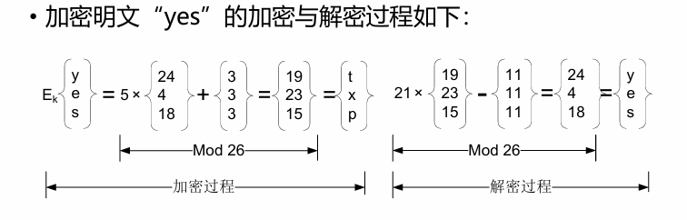    
*仿射密码加密yes示例*
- 基于统计的密码分析  
• 简单代替密码的加密是从明文字母到密文字母的一一映射  
• 攻击者统计密文中字母的使用频度，比较正常字母的使用频度，进
行匹配分析。  
• 如果密文信息足够长，很容易对单表代替密码进行破译。  

### 2.2.2 多表代替密码
• 多表代替密码是以一系列代替表依次对明文消息的字母进行代替
的加密方法  
• 多表代替密码使用从明文字母到密文字母的多个映射来隐藏单字
母出现的频率分布  
• 每个映射是简单代替密码中的一对一映射  
• 若映射系列是非周期的无限序列，则相应的密码称为非周期多表代替密
码  
• 非周期多表代替密码  
• 对每个明文字母都采用不同的代替表(或密钥)进行加密，称作一次一密
密码  

- 维吉尼亚Vigenère密码
• 经典的多表代换密码有：  
• Vigenère、Beaufort、Running Key、Vernam和
轮转机等密码。  
• 维吉尼亚Vigenère密码  
• 是以移位代替为基础的周期多表代替密码。  
• 加密时每一个密钥被用来加密一个明文字母，当所
有密钥使用完后，密钥又重新循环使用。  
• 维吉尼亚Vigenère密码算法如下：  
• Ek(m)=C1 C2 … Cn，其中Ci=（mi + ki）mod 26；  
• 密钥K可以通过周期性反复使用以至无穷。  

### 2.3 对称密钥密码

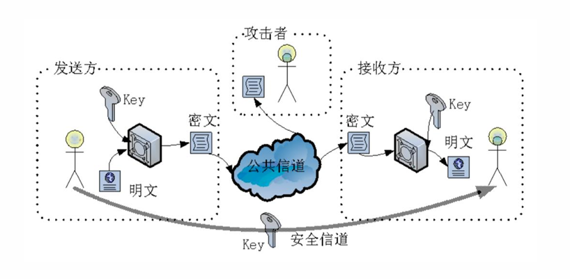      

*对称密钥密码示例*

#### 2.3.1 对称密钥密码加密模式

• 对称密码加密系统从工作方式上可分为：  
• 分组密码、序列密码  
• 分组密码原理：  
• 明文消息分成若干固定长度的组，进行加密；解密亦然。  
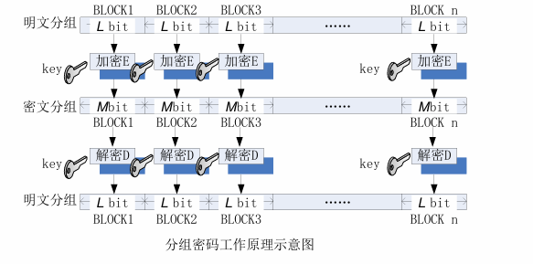      

*分组密码工作原理示意图*

- 序列密码（流密码）
•通过伪随机数发生器产生性能优良的伪随机序列(密钥流)，
用该序列加密明文消息流，得到密文序列；解密亦然。

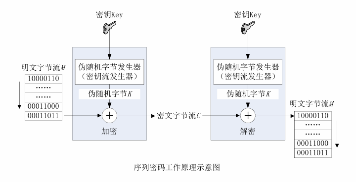      

*序列密码工作原理示意图*

#### 2.3.2 数据加密标准DES
- 1973年美国国家标准局NBS公开征集国家密码标准方
案；
1. 算法必须提供高度的安全性；
2. 算法必须有详细的说明，并易于理解；
3. 算法的安全性取决于密钥，不依赖于算法；
4. 算法适用于所有用户；
5. 算法适用于不同应用场合；
6. 算法必须高效、经济；
7. 算法必须能被证实有效；
8. 算法必须是可出口的。  
• 1974年NBS开始第二次征集时，IBM公司提交了算法
LUCIFER。  
• 1977年LUCIFER被美国国家标准局NBS作为“数据加密标
准FIPS PUB 46”发布，简称为DES  

- S-DES
• S-DES是由美国圣达卡拉大学的 Edward Schaeffer 教授提出的，主要用于教学，其设计思想和性质,DES一致，有关函数变换相对简化，具体参数要小得多。  
• 输入：  
• 一个8位的二进制明文组  
• 一个10位的二进制密钥  
• 输出：  
• 一个8位二进制密文组  
• 解密与加密基本一致  
• 加密:IP-1(fk2(SW(fk1(IP(明文)))))    
• 解密: IP-1(fk1(SW(fk2(IP(密文)))))  
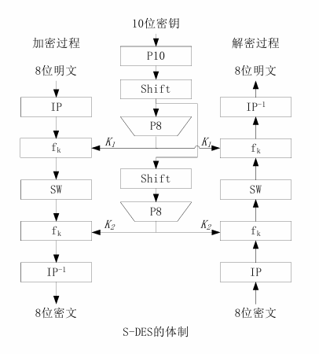      

*S-DES的体制示意图*

- S-DES的密钥产生
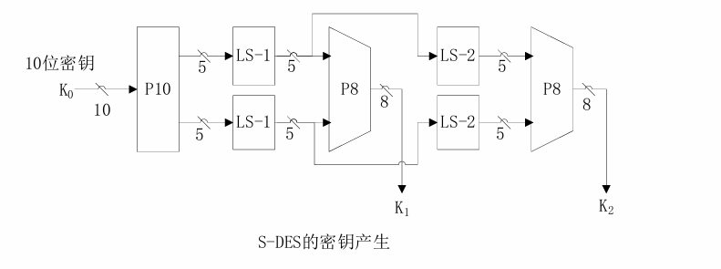      

*S-DES的密钥产生示意图*
• P10=(3,5,2,7,4,10,1,9,8,6)  
• 循环左移函数LS  
• P8=(6,3,7,4,8,5,10,9) 

- S-DES的加密变换过程
• IP=(2,6,3,1,4,8,5,7)；  
• IP-1=(4,1,3,5,7,2,8,6)  
• E/P=（4,1,2,3,2,3,4,1）  
• “⊕”:按位异或运算；  
• P4=（2,4,3,1）  
• S盒函数  
• S0和S1为两个盒子函数，将输入作为索引查表，得到相应的系数作为输出。  
• SW:将左4位和右4位交换。  
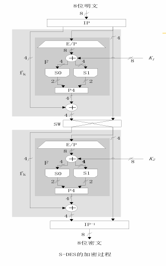      

*S-DES的加密过程示意图*
- S盒函数
•S盒函数按下述规则运算：  
•输入的第1位和第4位二进制数合并为一个两位二进制数，作为S盒的行号索引i；  
•将第2位和第3位同样合并为一个两位二进制数，作为S盒的列号索引j，  
•确定S盒矩阵中的一个系数（i，j）。  
•此系数以两位二进制数形式作为S盒的输出。  
•例如：  
• L'=（l0 ,l1 ,l2 ,l3）=（0，1，0，0），（i，j）=（0,2）  
•在S0中确定系数3，则S0的输出为11B  
- DES算法  
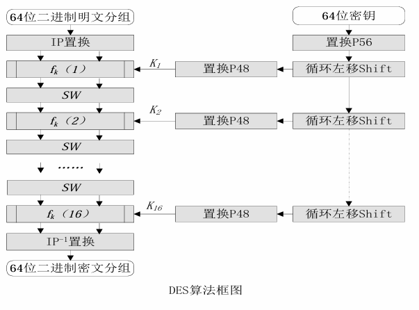      

*DES算法框图*
- DES的安全问题
• 1977年，耗资两千万美元建成一个专门计算机用于DES的
破译，需要12个小时的破解才能得到结果。  
• 1994年世界密码大会，M.Matsui提出线性分析方法，利
用243个已知明文，成功破译DES。  
• 1997年首届“向DES挑战”的竞技赛。罗克·维瑟用了96
天时间破解了用DES加密的一段信息。  
• 2000年1月19日，电子边疆基金会组织25万美元的DES解
密机以22.5小时成功破解DES加密算法。  
• DES的最近一次评估是在1994年，同时决定1998年12月
以后，DES将不再作为联邦加密标准。  

#### 2.3.3 分组密码的工作模式

1. •电子编码本模式（ECB）  
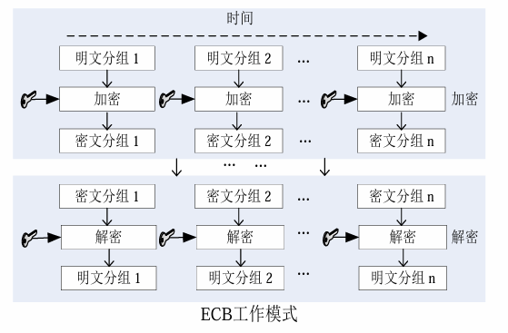      

*ECB工作模式*
2. 密码分组链接模式（CBC）  
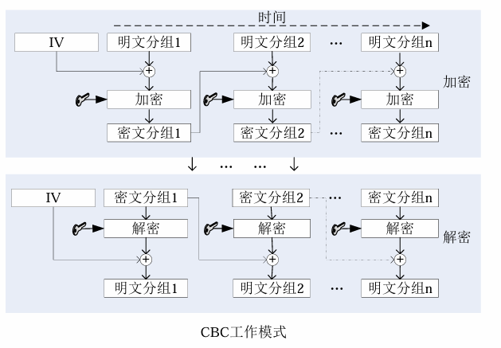      

*CBC工作模式*
3. 密码反馈模式（CFB）  
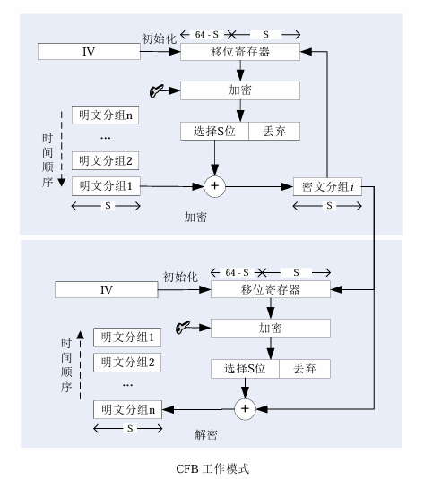      

*CFB工作模式*
4. 输出反馈模式（OFB）  
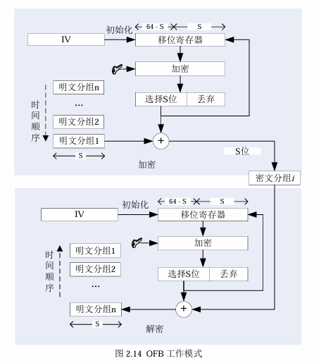      

*OFB工作模式*

#### 2.3.4其他对称密码简介
- 三重DES
- RC5
- IDEA
- AES算法

### 2.4 公开密钥密码
• 公开密钥密码又称非对称密钥密码或双密钥密码  
• 加密密钥和解密密钥为两个独立密钥。  
• 公开密钥密码的通信安全性取决于私钥的保密性。  
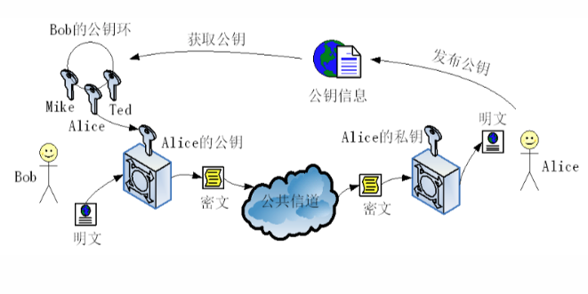      

*公开密钥密码*
#### 2.4.1 公开密钥理论基础
公开密钥密码的核心思想  
• 公开密钥密码是1976年由Whitfield 
Diffie和Martin Hellman提出的。  
• 单向陷门函数f(x)，必须满足以下三
个条件。  
①给定x，计算y=f(x)是容易的；  
②给定y, 计算x使y=f(x)是困难的（所谓计算x=f-1(y)困难是指计算上相当复杂已无实际意义）；  
③存在δ，已知δ时对给定的任何y，若相应的x存在，则计算x使y=f(x)是容易的。

- 公开密钥的应用：加密模型  
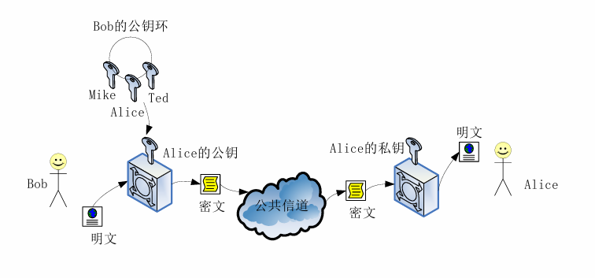      

*加密模型*
- 公开密钥的应用：认证模型  
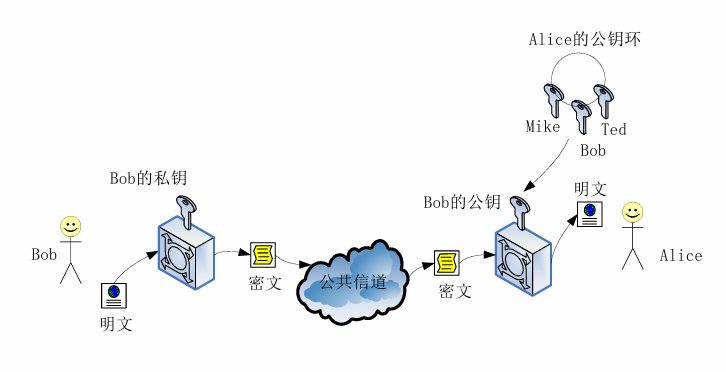      

*认证模型*

#### 2.4.2 Diffie-Hellman密钥交换算法
• 数学知识  
• 原根  
• 素数p的原根（primitive root）的定义：如果a是素数p的原根，则数a mod p, a2 mod p,…, ap-1 mod p是不同的并且包含从1到p-1之间的所有整数的某种排列。对任意的整数b，可以找到唯一的幂i，满足b ≡a的i次方 mod p，且1≤i≤p-1。  
• 注：“b ≡ a mod p”等价于“b mod p = a mod p”，称为“b与a模p同余”。  
• 离散对数  
• 若a是素数p的一个原根，  
• 则相对于任意整数b（b mod p≠0），  
• 必然存在唯一的整数i（1≤i≤p-1），  
• 使得b≡ai mod p，i称为b的以a为基数且模p的幂指数，即离
散对数。  
• 求解离散对数  
• 对于函数y≡gxmod p，其中，g为素数p的原根，y与x均为正整数，已知g、x、p，计算y是容易的；而已知y、g、p，计算x是困难的，即求解y的离散对数x。  
• 注：离散对数的求解为数学界公认的困难问题。  

- Diffie-Hellman密钥交换算法
• Alice和Bob协商好一个大素数p，和大的整数g，1<g<p，g是p的原根。p和g无须保密，为网络上的所有用户共享。  
• 当Alice和Bob要进行保密通信时，他们可以按如下步骤来做：  
①Alice选取大的随机数x<p，并计算Y=gx(mod P)；  
②Bob选取大的随机数x<p，并计算Y=gx(mod P)；  
③Alice将Y传送给Bob，Bob将Y传送给Alice；  
④Alice计算K=(Y')X(mod P)，Bob计算K'＝(Y)X '(mod P)  
• 显而易见K=K'=gxx'(mod P)，即Alice和Bob已获得了相同的秘密值K  
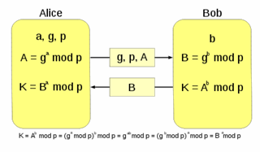      

*Diffie-Hellman*

### 2.4.3 RSA公开密钥算法
1. 欧拉定理  
• 欧拉函数是欧拉定理的核心概念，其表述：对于一个正整数n，由小于n且和n互素的正整数构成的集合为Zn，这个集合被称为n的完全余数集合。Zn包含的元素个数记做φ(n)，称为欧拉函数，其中φ(1)被定义为1，但是并没有任何实质的意义。  
• 如果两个素数p和q，且n = p×q ，则φ(n) =(p-1)(q-1)；  
• 欧拉定理的具体表述：正整数a与n互素，则aφ(n)≡ 1 mod n。  
2. 推论：  
• 给定两个素数p和q，以及两个整数m、n，使得n = p×q，且0<m<n，对于任意整数k下列关系成立  
m k φ(n)+1 = m k(p-1)(q-1)+1 ≡ m mod n。  
3. 大整数因子分解  
大整数因子分解问题：  
• 已知p、q为两个大素数，则求N=p×q是容易的，只需要一次乘法运算；但已知N是两个大素数的乘积，要求将N分解，则在计算上是困难的，其运行时间复杂程度接近于不可行。  
• 算法时间复杂性：  
• 如果输入规模为n时，一个算法的运行时间复杂度为O(n)，称此算法为
线性的；  
• 运行时间复杂度为O(nk)，其中k为常量，称此算法为多项式的；  
• 若有某常量t和多项式h(n)，使算法的运行时间复杂度为O(th(n))，则称此
算法为指数的。  
• 一般说来，  
• 在线性时间和多项式时间内被认为是可解决的，比多项式时间更坏的，
尤其是指数时间被认为是不可解决的。  
• 注：如果输入规模太小，即使很复杂的算法也会变得可行的。  
4. RSA密码算法  
• RSA密码体制：  
• 明文和密文均是0到n之间的整数，n通常为1024位二进制
数或309位十进制数，  
• 明文空间P=密文空间C={x∈Z|0<x< n,Z为整数集合}。  
• RSA密码的密钥生成具体步骤如下：  
①选择互异的素数p和q，计算n=pq，φ(n) = (p - 1)(q - 1)；  
②选择整数e，使gcd(φ(n),e) = 1，且1 < e < φ(n)；  
③计算d，d = e-1 mod φ(n)，即d为模φ(n)下e的乘法逆元；  
• 公钥Pk= { e, n }，私钥Sk = { d, n, p, q }  
• 加密：c = me mod n；解密：m = cd mod n。  
5. RSA例  
① p=101，q＝113，n=11413，φ(n)=100×112＝11200。  
② e = 3533，求得d = e-1 mod 11200 = 6597 mod 11200，d = 6597。  
③ 公开n=11413和e=3533，  
④ 明文9726，计算97263533 mod 11413 = 5761，发送密文5761。  
⑤ 密文5761时，用d＝6597进行解密，计算57616597（mod 11413)=9726。  
6. RSA的安全性  
• RSA是基于单向函数ek(x)=xe(mod n) ，求逆计算不可行。  
• 解密的关键是了解陷门信息，即能够分解n=pq，知道φ(n)=(p-1)(q-1)，从而解出解密私钥d。  
• 如果要求RSA是安全的，p与q必为足够大的素数;  
• 使分析者没有办法在多项式时间内将n分解出来。  
• 模n的求幂运算  
• 著名的“平方-和-乘法”方法将计算xcmod n的模乘法的次数缩小到至多为2l，l是指数c二进制表示的位数  
### 2.4.4 其他公开密钥密码简介
• 基于大整数因子分解问题:  
• RSA密码、Rabin密码  
• 基于有限域上的离散对数问题：  
• Diffie-Hellman公钥交换体制、ElGamal密码  
• 基于椭圆曲线上的离散对数问题：  
• Diffie-Hellman公钥交换体制、ElGamal密码。  

### 2.5 消息认证
#### 2.5.1概述  
• 威胁信息完整性的行为主要包括：  
• 伪造：假冒他人的信息源向网络中发布消息；  
• 内容修改：对消息的内容进行插入、删除、变换和修改；  
• 顺序修改：对消息进行插入、删除或重组消息序列；  
• 时间修改：针对网络中的消息，实施延迟或重放；  
• 否认：接受者否认收到消息，发送者否认发送过消息。  
• 消息认证是保证信息完整性的重要措施  
• 其目的主要包括：  
• 证明：消息的信源和信宿的真实性；  
• 证明：消息内容是否曾受到偶然或有意的篡改，  
• 证明：消息的序号和时间性是否正确。  
• 消息认证由具有认证功能的函数来实现的  
• 消息加密，用消息的完整密文作为消息的认证符；  
• 消息认证码MAC（Message Authentication Code），也称密码校验和，使用密码对消息加密，生成固定长度的认证符；  
• 消息编码，是针对信源消息的编码函数，使用编码抵抗针对消息的攻击。 

#### 2.5.2 认证函数  
• 认证技术在功能上可以分为两层  
• 下层包含一个产生认证符的函数，认证符是一个用来认证消息的值；  
• 上层是以认证函数为原语，接收方可以通过认证函数来验证消息的真伪  
1. 消息加密函数
•对称密钥密码对消息加密，不仅具有机密性，同时也具有一定的可认证性;  
•公开密钥密码本身就提供认证功能，其具有的私钥加密、公钥解密以及反之亦然的特性;   
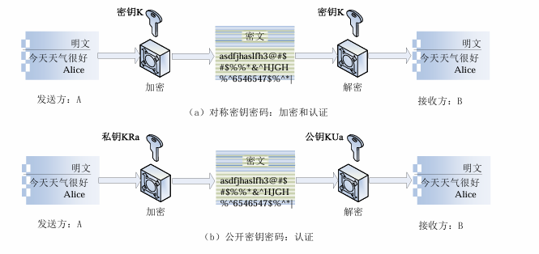      

*消息加密函数*  
2. 消息认证码
消息认证码MAC的基本思想：  
• 利用事先约定的密码，加密生成一个固定长度的短数据块MAC，并将MAC附加到消息之后，一起发送给接收者；  
• 接收者使用相同密码对消息原文进行加密得到新的MAC，比较新的MAC和随消息一同发来的MAC，如果相同则未受到篡改。  
生成消息认证码的方法：  
• 基于加密函数的认证码和消息摘要（在散列函数中讨论）。  
• 消息认证符可以是整个64位的On，也可以是On最左边的M位。  
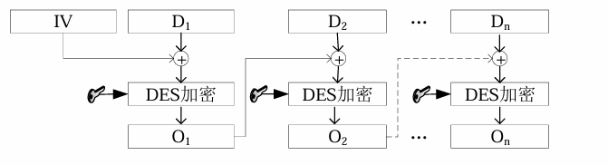      

*消息验证码*    
3. 消息编码  
• 消息编码认证的基本思想：  
• 引入冗余度，使通过信道传送的可能序列集M（编码集）大于消息集S（信源集）。  
• 发送方从M中选出用来代表消息的许用序列Li，即对信息进行编码；  
• 接收方根据编码规则，进行解码，还原出发送方按此规则向他传来的消息。  
• 窜扰者不知道被选定的编码规则，因而所伪造的假码字多是M中的禁用序列，接收方将以很高的概率将其检测出来，并拒绝通过认证。  
• 消息编码认证  
• 如果决定采用L0，则以发送消息“00”代表信源“0”，发送消息“10”代表信源“1”。  
• 在子规则L0下，消息“00”和“10”是合法的  
• 消息“01”和“11”在L0之下不合法，收方将拒收这两个消息。  

#### 2.5.3 散列函数
• 散列函数（Hash Function）的目的  
• 将任意长的消息映射成一个固定长度的散列值（hash值），也称为消息摘要。消息摘要可以作为认证符，完成消息认证。  
• 散列函数的健壮性  
• 弱无碰撞特性  
• 散列函数h被称为是弱无碰撞的，是指在消息特定的明文空间X中，给定消息x∈X，在计算上几乎找不到不同于x的x'，x'∈X，使得h(x)=h(x')。  
• 强无碰撞特性  
• 散列函数h被称为是强无碰撞的，是指在计算上难以找到与x相异的x'，满足h(x)=h(x')，x'可以不属于X。  
• 单向性
• 散列函数h被称为单向的，是指通过h的逆函数h-1来求得散列值h(x)的消息原文x，在计算上不可行。  
散列值的安全长度  
生日悖论  
• 如果一个房间里有23个或23个以上的人，那么至少有两个人的生日相同的概率要大于50%。对于60或者更多的人，这种概率要大于99%。  
• 不计特殊的闰年，计算房间里所有人的生日都不相同的概率  
① 第一个人不发生生日冲突的概率是 ，365/365  
② 第二个人不发生生日冲突的概率是，1-1/365，...，  
③ 第n个人是，1-(n-1)/365，  
④ 所有人生日都不冲突的概率是：  
E = 1x{1-(1/365)}x...x{1-(n-2/365)}x{1-(n-1/365)},  
⑤ 而发生冲突的概率P=1-E，当n=23时，P≈0.507；n=100时，  
P≈0.9999996。  
散列值的安全长度  
生日悖论对于散列函数的意义  
• n位长度的散列值，可能发生一次碰撞的测试次数不是2n次，而是大约2n/2次。  
• 一个40位的散列值将是不安全的，因为大约100万个随机散列值中将找到一个碰撞的概率为50%，  
• 消息摘要的长度不低于为128位。  

### 2.6 密码学新进展
- 混沌密码
• 1989年，英国数学家Matthews，基于混沌加密技术的混沌密码学;
• 混沌系统具有良好的伪随机特性、轨道的不可预测性、对初始状态及控制参数的敏感性等一系列特性;
• 传统的密码算法敏感性依赖于密钥，而混沌映射依赖于初始条件和映射中的参数；
• 传统的加密算法通过加密轮次来达到扰乱和扩散，混沌映射则通过迭代，将初始域扩散到整个相空间；
• 传统加密算法定义在有限集上，而混沌映射定义在实数域内。
- 量子密码
• 1970年威斯纳提出利用单量子态制造不可伪造的“电子钞票”，这个构想由于量子态的寿命太短而无法实现
• 1984年，IBM的贝内特和加拿大学者布拉萨德提出了第一个量子密码方案，由此迎来了量子密码学的新时期。
• 量子密码体系采用量子态作为信息载体，经由量子通道在合法的用户之间传送密钥。
• 量子密码的安全性由量子力学原理所保证，被称为是绝对安全的。
• 所谓绝对安全是指即使在窃听者可能拥有极高的智商、可能采用最高明的窃听措施、可能使用最先进的测量手段，密钥的传送仍然是安全的，可见量子密码研究具有极其重大的意义。
- DNA计算
• 1994年，Adleman等科学家进行了世界上首次DNA计算，解决了一个7节点有向汉密尔顿回路问题。
• 由于DNA计算具有的信息处理的高并行性、超高容量的存储密度和超低的能量消耗等特点，非常适合用于攻击密码计算系统的不同部分，对传统的基于计算安全的密码体制提出了挑战