# 工业大数据处理与应用 2026.10.8

## 在RobotStudio中的Smart组件多物块运动逻辑回顾

- **Queue编组与Source生成机制**
  - Queue被定义为一种数据类型或文件夹，用于装载多个图形组件对象
  - Source组件位于动作选项卡，功能是拷贝图形组件并生成新的克隆体
  - 生成的克隆体被直接放入Queue编组中，实现对多个物块的统一运动控制
- **运动控制逻辑简化**
  - 通过控制物块是否加入Queue编组来决定其是否向前移动
  - 物块生成时自动加入编组开始运动，传感器识别到物块时将其从编组剔除
  - 终点处通过删除组件移除物块，当前版本无法区分具体哪个物块抵达

## 检测灯信号输出配置演示

- **信号类型与命名**
  - 在Smart组件中添加数字输出信号
  - 信号用于将传感器识别结果传输至工作站逻辑层级
- **复位与不复位两种思路**
  - **自动复位**：识别到物体时产生脉冲信号，适用于打点计时器场景
  - **不复位**：忠实反映传感器状态，配合外部PLC时间戳管控可计算物块实际运动速度
  - 本次课堂演示选择自动复位信号，但指出RobotView视角下无法直接观察该信号状态
- **工作站逻辑层级说明**
  - 工作站逻辑是高于Smart组件的最高层级，界面类似Smart组件编辑器
  - 外部设备（PLC、机器人）在此层级以独立模块形式呈现，信号交互需通过Smart组件端口实现

## 离线编程概念与仿真软件选型

- **在线与离线编程区别**
  - 在线编程指在机器人旁实时控制，离线编程指在计算机中仿真工作场景并生成可部署程序
  - 数字孪生技术使虚拟环境中机器人的各轴运动与真实设备保持一致
- **主流仿真软件对比**
  - **RobotStudio**：ABB商业软件，全球市占率高，具备通信功能可连接真实设备
  - **RoboDK**：开源软件，动作仿真能力强但编程语句与实际机器人无关，通信功能有限
  - **NX**：西门子软件，通用性强可仿真复杂工业场景，但系统复杂度高，安装需100+GB空间（含60GB Oracle数据库及30+GB PLC仿真软件）
  - 本课程选用RobotStudio因其商业普及度及与ABB机器人的兼容性

## 工业机器人系统基本组成

- **三大核心器件**
  - **控制器**：承载运动学运算、伺服驱动及电源转换，是系统的运算与控制中心
  - **示教器（HMI）**：人机交互面板，用于显示数据、编写程序及发送指令，仅与控制器相连
  - **机器人本体**：包含六个伺服电机轴，仅与控制器相连，接收电信号执行运动
- **线缆连接规范**
  - 机器人与控制柜之间线缆可拆卸，适应不同厂区布局需求
  - 两根线缆配置时，粗线为电缆线，细线为编码器线
  - 三根线缆配置时，1-3轴电缆、4-6轴电缆、编码器线各一根
- **闭环控制原理**
  - 控制器输出运动学解算结果（角度制或弧度制）至伺服驱动器
  - 驱动器将数字信号转换为电信号驱动伺服电机旋转
  - 编码器检测轴的实际转角并反馈至控制器，形成误差补偿闭环

## 工业机器人四大家族品牌特性对比

- **发那科（FANUC）**
  - 日系品牌，黄色/白色机身配红色Logo，示教器为上屏下按钮布局
  - 起源于数控系统，精度高但高负载及高速性能较弱
- **安川（Yaskawa）**
  - 日系品牌，蓝色机身，示教器布局与发那科相似
  - 起源于伺服电机，速度快、过载稳定性好，但精度略低于发那科
  - 其为四大家族中价格最低、性价比最高的选项
- **库卡（KUKA）**
  - 德系品牌，橙色/白色机身，示教器配备六自由度3D摇杆
  - 使能按键为三段式（左右两侧及背部圆柱），人机交互体验较好
  - 起源于焊接设备，大负载领域优势明显，系统集成业务成熟
  - 其故障率在横向对比中相对较高；已被美的收购
- **ABB**
  - 瑞士品牌，白色机身（早期有橙色），新款示教器为平板形态支持3D模型渲染
  - 起源于变频器及电力设备，算法稳定性及文档完善度较好
  - 其价格为四大家族中最高；控制柜分焊接/喷涂柜、标准柜、紧凑型柜（如IRB120用）

## 控制器内部架构与核心模块

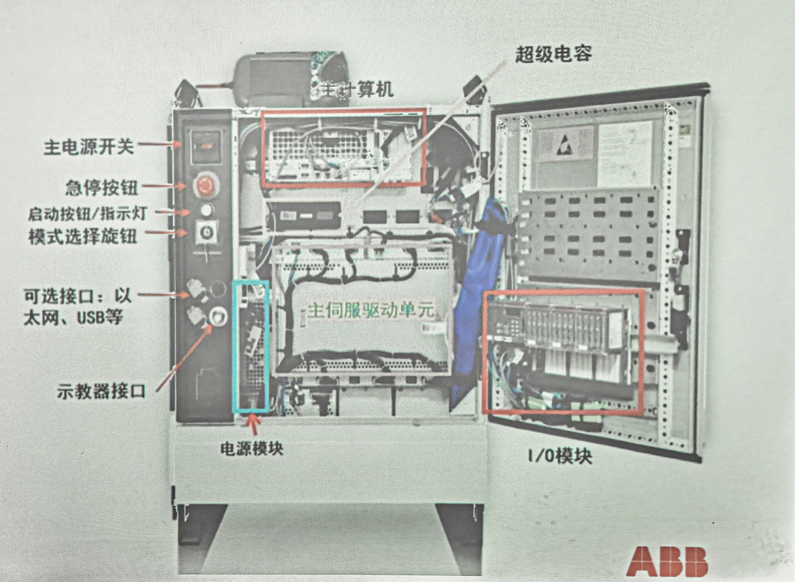  

*图  控制柜内部结构*

- **四大核心功能模块**
  - **电源模块**：将380V/220V交流电转换为伺服电机及控制电路所需的直流电
  - **主控模块**：执行系统运行、运动学正逆解算（3×3或6×6矩阵运算）、插补运算
  - **运动控制模块**：接收主控模块的角度/弧度结果，转发至伺服驱动器
  - **驱动模块**：将数字运动结果转换为电信号驱动伺服电机，ABB IRC5中集成于柜体中部
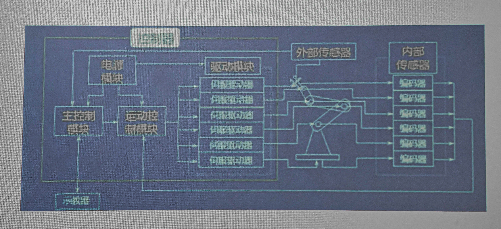  

*图  四大核心功能模块*  

- **辅助与通信模块**
  - **通信模块**：位于柜门内侧，提供IO接口连接传感器、指示灯、PLC、工业以太网及相机
  - **辅助单元**：包含电容，用于断电后维持主控模块短暂供电以保存数据
  - **抱闸装置**：伺服电机内置电磁刹车，断电时机械抱紧轴体防止坠落
- **三种控制器硬件架构**
  - **单片机**：成本低，适用于小规模、低精度、性能要求不高的场景
  - **PLC**：技术成熟、长周期稳定，但功能受限于PLC自身能力，开发周期较长
  - **IPC（工业计算机）**：功能开放可深度定制软硬件协同，但开发周期远大于PLC方案
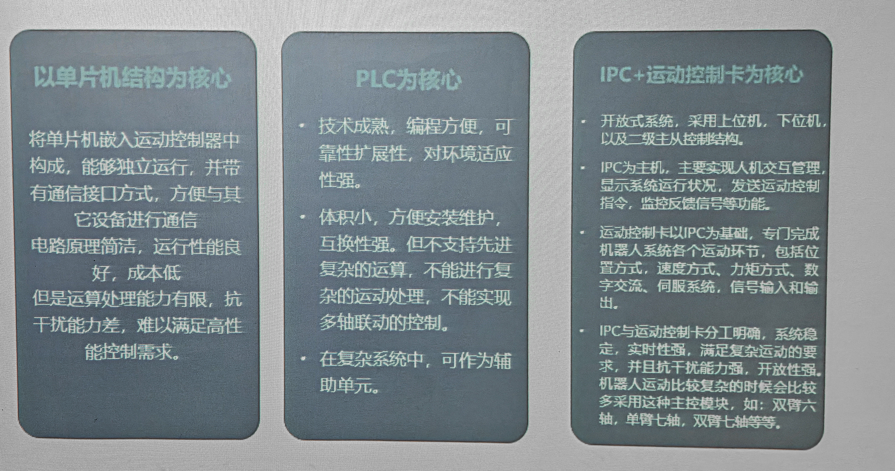  

*图  三种控制器硬件架构*  

## 运行模式与安全操作机制

- **手动与自动模式切换**
  - 手动模式用于编程调试、示教点位，速度受限，需持续按压使能键
  - 自动模式用于程序验证通过后的连续生产，速度远高于手动，操作员不应在场
  - 模式切换通过钥匙旋钮实现，部分大型ABB机器人支持手动全速模式（速度不加限）
- **使能键与电机上电**
  - 使能键为两段式按钮，仅在手动模式下有效，松开或按到底均会停止运动
  - 自动模式下电机上电通过独立按钮控制，白色常亮表示上电，闪烁表示待机
  - 自动运行中误按使能键会导致机器人立即停止
- **急停与安全回路设计**
  - 急停按钮采用常闭触点，规避线路断裂导致失效的风险
  - 安全IO面板提供跳线接口，可将外部急停按钮物理接入安全回路
  - 急停触发类型包括系统故障、超程、奇异点（运动学不可解姿态）、断路器断开
  - 解除急停需先顺时针旋转松开按钮，再按电机上电按钮恢复
- **双人安全锁制度**
  - 大型汽车产线调试要求至少两人同时在场，每人佩戴联网安全锁
  - 安全锁扣入指定位置后，系统禁止切换至自动模式

## 六轴运动学与手动操纵基础

- **轴序与人体拓扑映射**
  - 1轴位于底部，模拟腰部横转；2轴模拟俯仰；3轴模拟肩膀抬升下降
  - 1-3轴为大臂，负载能力较大；4-6轴为小臂及腕部
  - 4轴模拟前臂自旋，5轴模拟腕部上下摆动，6轴模拟腕部自旋
- **手动操纵重要性**
  - 手动操纵熟练度直接影响编程效率与最终运行精度
  - 所有自动运行程序必须先在手动模式下逐步调试验证通过
  - IRB120为3kg负载小型机器人，1轴同样位于底部
- **机器人的常用坐标系**
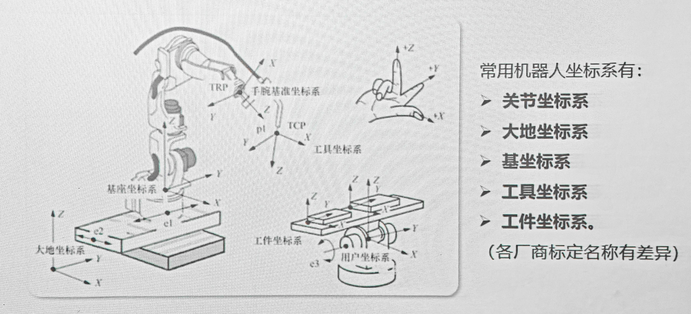  

*图  机器人的常用坐标系*  

## 在RobotStudio中进行机器人的建模及其运动

1. 打开RobotStudio，创建新的空工作站  
2. 创建机器人  
- 在主页面上方 -> 基本 -> ABB模型库 选择`IRB 2600`型号机器人  
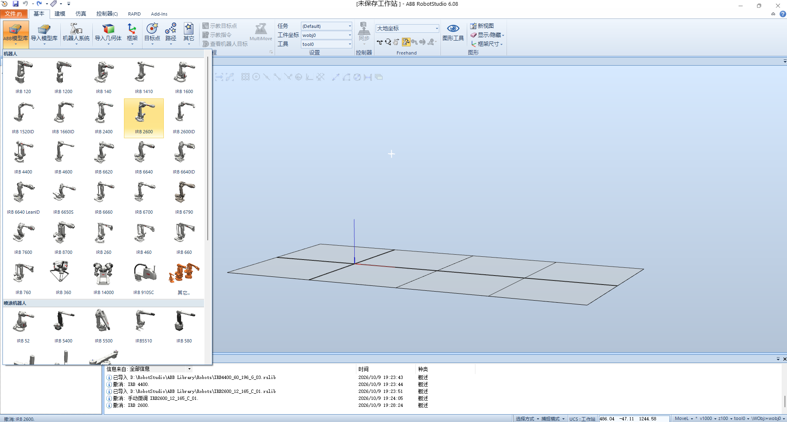  

*图  选择IRB 2600*
  
- 默认设置即可  
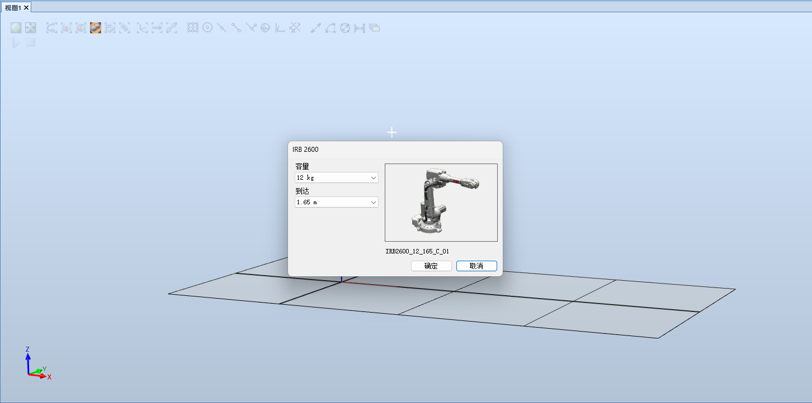  

*图  选择IRB 2600*
  
- 此时创建完毕，因为没有创建机器人系统，所以现在只能对机器人进行手动关节的移动，并不能进行线性或重定位移动  
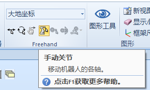  

*图  可看见手动关节右边的选项卡都是不可选状态*
3. 创建机器人系统  
- 在主页面上方 -> 基本 -> 机器人系统 选择`从布局...`选项卡  
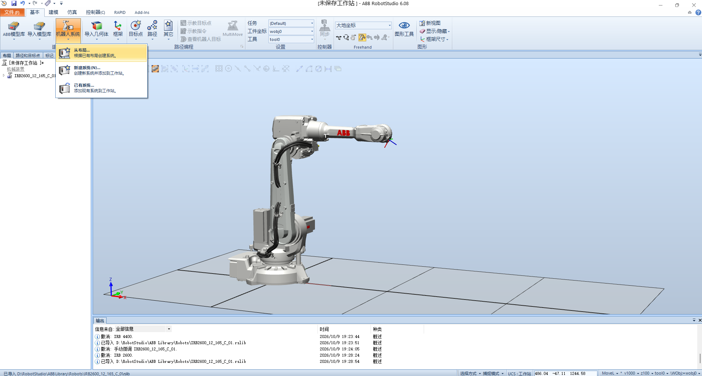  

*图  创建机器人系统*
- 出现相应窗口，在这里默认即可，也可以根据个人需求更改名称/存储位置，随后点击下一步  
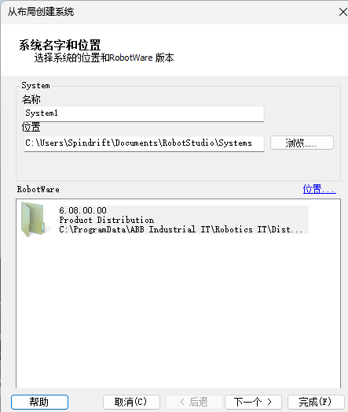  

*图  创建机器人系统*
- 继续点击下一步  
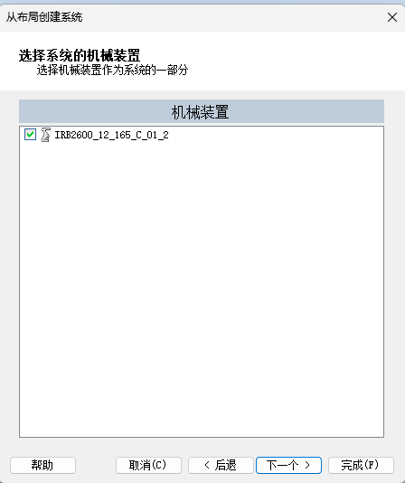  

*图  创建机器人系统*
- 在当前页面进行选项的配置，点击蓝色高亮的`选项`按钮  
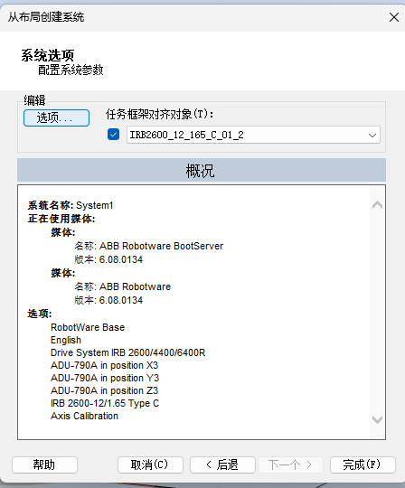  

*图  创建机器人系统*
- 更改语言为简体中文，在 类别 -> Default Language 中选择Chinese，确定替换即可  
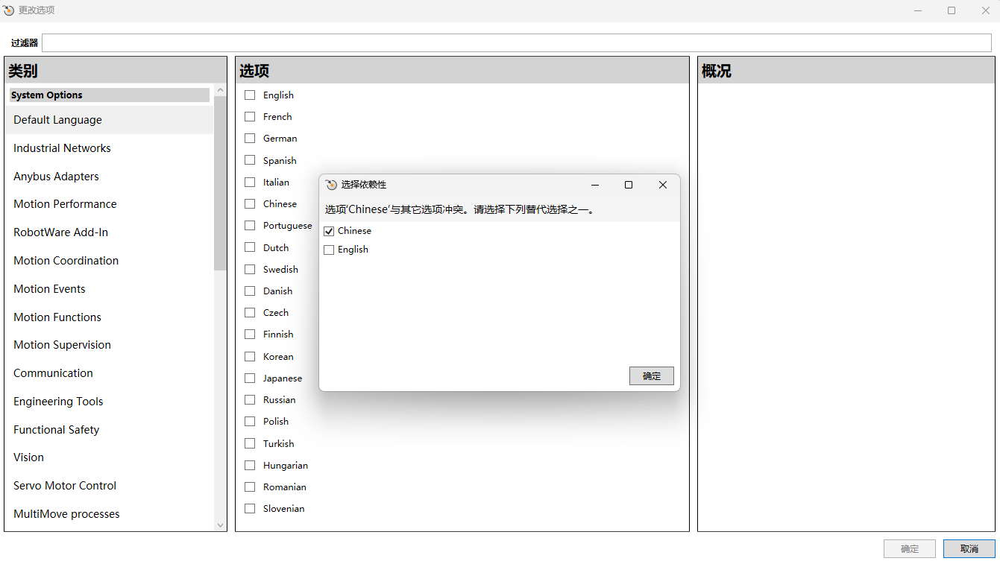  

*图  创建机器人系统*
- 增加配置文件，在 类别 -> Industrial Networks 中选择 709-1 与 888-2 配置  
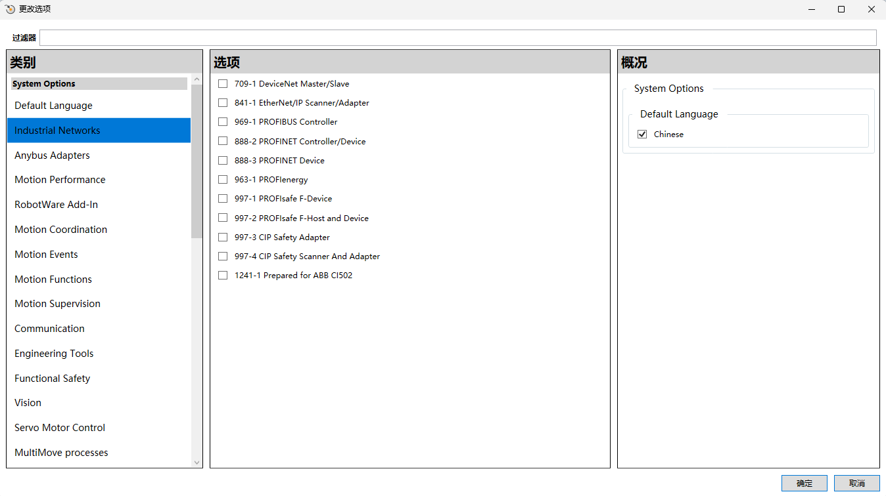  

*图  创建机器人系统*
- 全部配置好后应该在当前页面的右侧`概况`中出现三个选项，如图，确定即可  
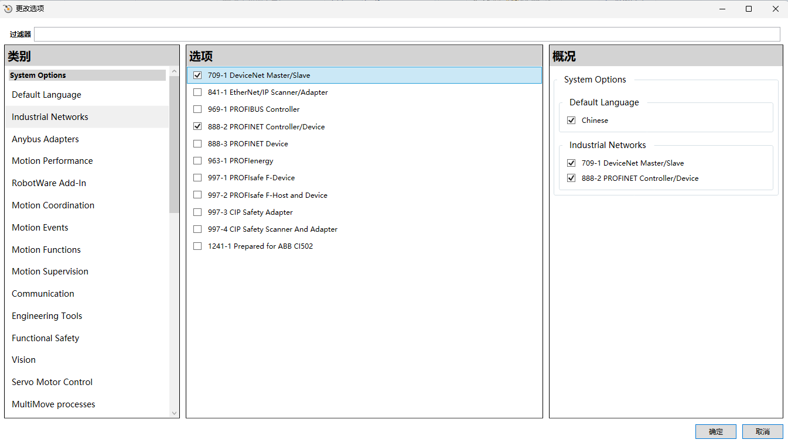  

*图  创建机器人系统*
- 回到之前的页面，点击蓝色高亮`完成`即可  
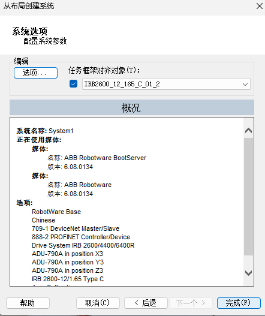  

*图  创建机器人系统*
- 程序会自动模拟创建机器人控制系统与启动，待完成后其主页面右下角应该为`控制器状态 1/1`，绿色或黄色显示即表示可以正常使用  
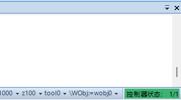  

*图  创建机器人系统*  
4. 运动机器人  
- 此时可以在左侧`布局`选项卡中选择当前的机器人并右键，此时可以发现支持手动线性/手动关节运动  
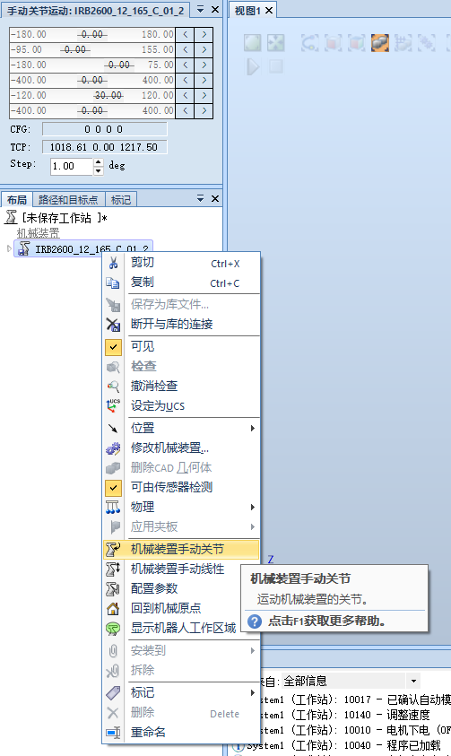  

*图  手动线性运动*  
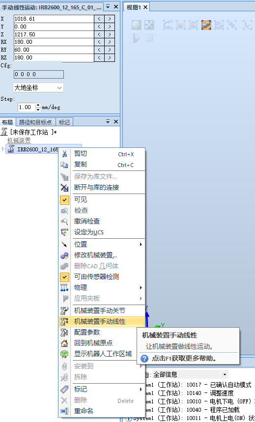  

*图  手动关节运动*  
- 也可以在主页上方的`FreeHand`标签选项卡中选择手动线性/手动重定位运动  
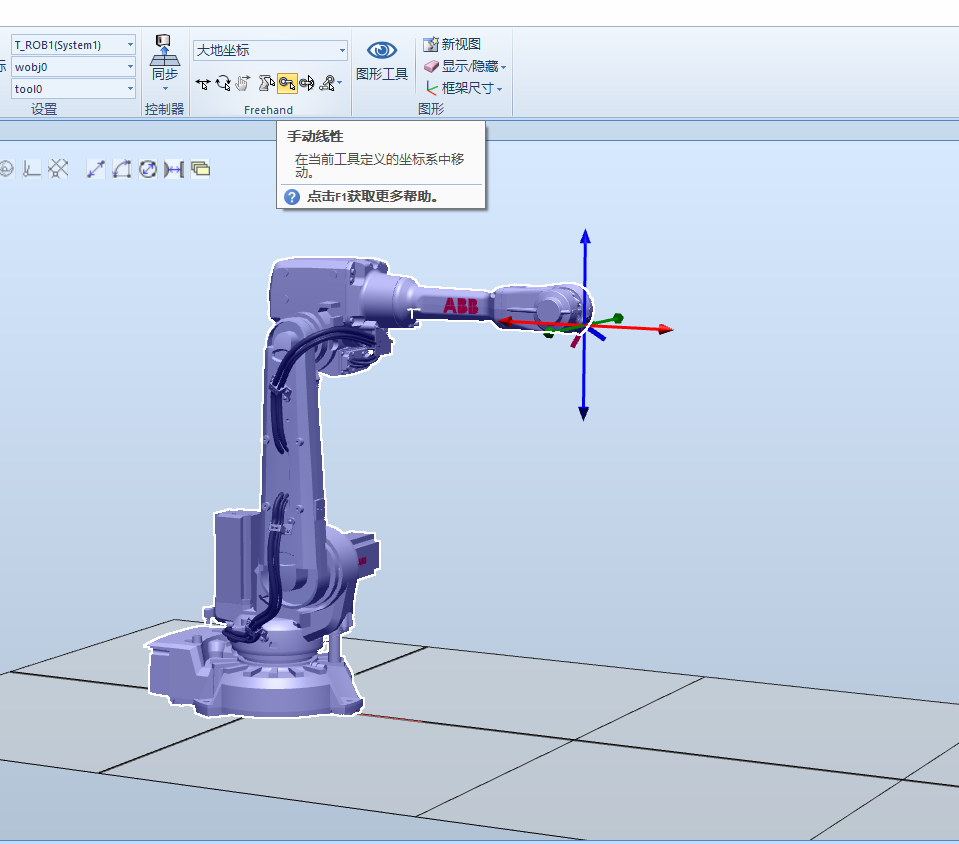  

*图  手动线性运动*  
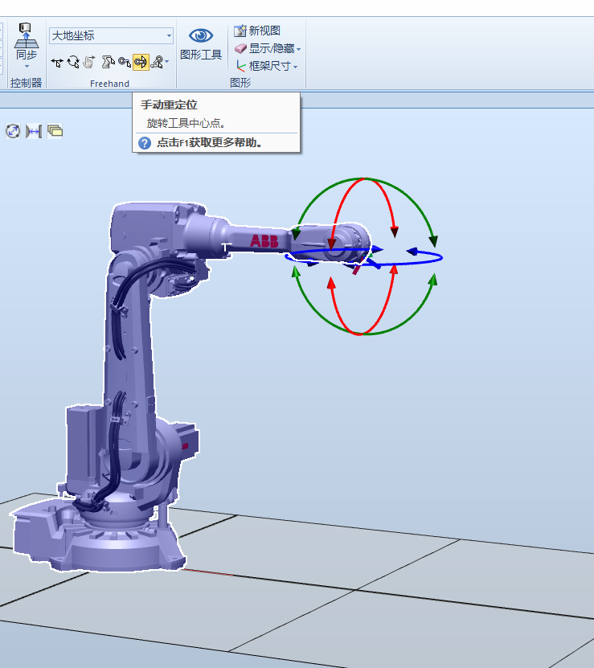  

*图  手动重定位运动*  
- 手动线性动图示例：  
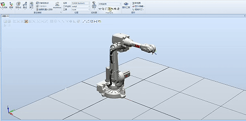  

*动图  手动线性运动*  
- 手动重定位动图示例：  
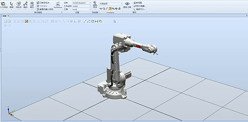  

*动图  手动重定位运动*  
- 当想恢复机器人状态到初始状态时，此时可以在左侧`布局`选项卡中选择当前的机器人并右键，点击`回到机械原点`即可  
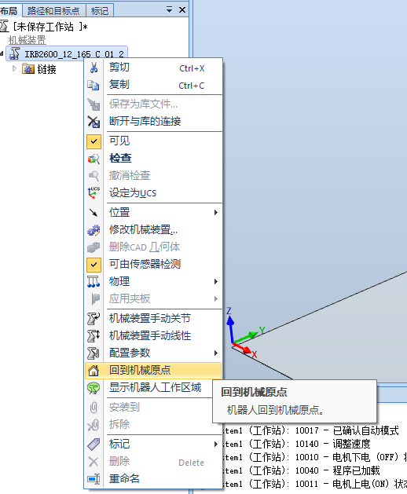  

*图  手动重定位运动*  
- 使机器人回到初始状态示例：  
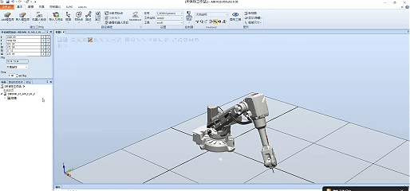  

*动图  恢复机器人状态*
5. 使用“示教器”操控机器人  
- 在主页面上方 -> 控制器  选择`示教器`选项卡  
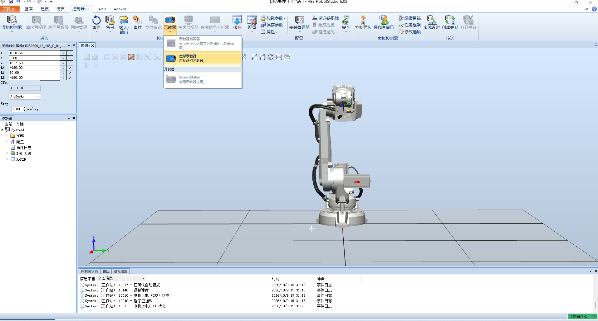  

*图  示教器*  
- 示教器页面  
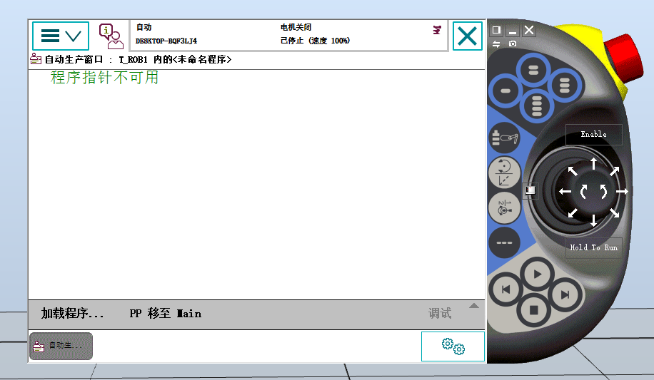  

*图  示教器*   
- 本节课示教器的操作按键说明  
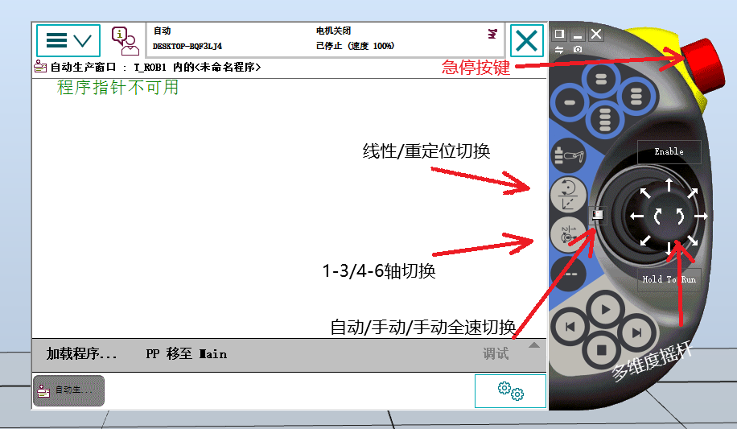  

*图  示教器*  
- 自动、手动、全速手动切换  
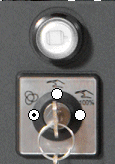  

*图  自动*  
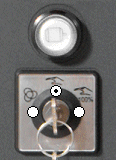  

*图  手动*  
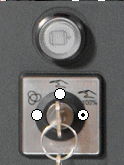  

*图  手动全速*  
- 1-3/4-6机械臂切换及显示  
示教器的按键：   
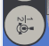  

*图  机械臂切换按键*  
- 显示状态  

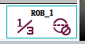  

*图  机械臂显示状态*  
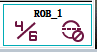  

*图  机械臂显示状态*
- 线性/重定位切换及显示  
示教器的按键：   
  

*图  机械臂切换按键*  
- 显示状态  

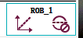  

*图  机械臂显示状态*  
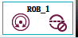  

*图  机械臂显示状态*