# 工业大数据处理与应用  2026.9.21上课笔记

课程为理论实操一体课  
工业设备和生产活动持续产生的海量数据，经过汇集和分析，用于理解状态，改进生产  
设备侧：温度、振动、转速等随时间变化的记录  
业务侧：与生产相关的设计、订单、质量和维护记录  
这些数据共同帮助我们回答：发生了什么，为什么发生？  
工业大数据的特点：

| 特点 | 在工厂中的表现 |
|------|----------------|
| 量大 | 多台设备长期积累运行记录 |
| 产生快 | 部分测点持续、高频地产生数据 |
| 类型多 | 数值记录、设备日志、质检图片并存 |

分析的时候还要知道：数据对应哪台设备，什么工况（缺失、不同步或测量误差都可能影响判断）。

按数据的组织方式，可以分为三类：

| 类型 | 组织方式 | 工业场景的例子 |
|------|----------|----------------|
| 结构化数据 | 固定字段，按行列组织 | 已整理的温度记录表、订单表 |
| 半结构化 | 用键值或标签组织，字段灵活 | Json设备信息、XML记录 |
| 非结构化 | 内容不按固定字段表组织 | 质检照片、现场视频、维修描述 |

## 传感器

感知温度、压力、振动等物理量，并将其转换为可供后续采集与处理的信号  

## 第一章 工业设备传感器

### 1.1 工业设备传感器概述

#### 1.1.1 工业设备传感器的类型

传感器是一种以一定精度将被测量转换为与之有确定对应关系、易于精确处理和测量的某种物理量的测量部件或装置。完整的传感器应包括敏感元件、转化元件、基本转化电路三个基本部分。  

#### 1.1.2 传感器的性能指标

1. 灵敏度  
灵敏度是指传感器的输出信号达到稳定时，输出信号变化 *Δy* 与输入信号变化 *Δx* 的比值，假如传感器的输出和输入呈线性关系，其灵敏度可表示为：*S=Δy/Δx*；式中，*S* 为传感器的灵敏度， *Δy* 为传感器输出信号的增量， *Δx* 为传感器输入信号的增量。若传感器的输出信号与输入信号呈非线性关系，其灵敏度便是该曲线的导数，即 *S=dy/dx*  
2. 线性度  
如图4-2所示，线性度反映传感器输入信号 *x* 与输出信号 *y* 之间的线性程度，用公式表示为 *y=bx* ，若 *b* 是一个变化较大的量，则传感器的线性度较差。工业机器人控制系统应该选用线性度较高的传感器  
图4-2  
3. 精度  
精度是指传感器的测量输出值与实际被测量值之间的误差，在工业设备系统设计中，应该根据系统的工作精度要求选择合适的传感器精度  
4. 测量范围
测量范围是指被测量的最大允许值和最小允许值之差。传感器的测量范围应该覆盖工业设备有关被测量的工作范围。  
5. 重复性
特殊点：重复定位精度  
重复性是指传感器在其输入信号按同一方式进行全量程连续多次测量时，相应测量结果的变化程度。对于多数传感器来说，重复性指标优于精度指标。这些传感器的精度指标不一定很高，但只要它的温度、湿度、受力条件和其他参数不变，传感器的测量结果也没有较大的变化。同样，传感器重复性也应考虑使用条件和测量方法的问题  
6. 分辨率
分辨率是指传感器在整个测量范围内所能辨别的被测量的最小变化量，或者所能辨别的不同被测量的个数。工业设备大多对传感器的分辨率有一定的要求。传感器的分辨率直接影响机器人的可控程度和控制品质。传感器分辨率的最低限度要求一般根据机器人的工作任务而定  
7. 响应时间
响应时间是传感器的动态特性指标，是指传感器的输入信号变化后，其输出信号变化至一个稳定值所需要的时间。在一些传感器中，输出信号在达到某一稳定值以前会发生短时间地震荡  
8. 抗干扰能力
由于传感器输出信号的稳定是控制系统稳定工作的前提，为防止工业设备的意外动作或故障的发生，传感器系统设计必须采用可靠性设计技术，通常这个指标通过单位时间内发生故障的概率来定义，因此抗干扰能力实际是一个统计指标

#### 1.1.3 工业设备对传感器的一般要求

1. 精度高、重复性好
传感器的精度与重复性直接影响工业设备的工作质量，用于检测和控制机器人运动的传感器是控制机器人定位精度的基础。机器人是否能够准确无误地正常工作往往取决于传感器的测量精度
2. 稳定性好、可靠性高
传感器的稳定性和可靠性是保证工业设备能够长期稳定可靠地工作的必要条件。工业设备经常在无人照看的条件下代替人工操作的，万一其在工作中出现故障，轻则影响生产的正常运行，重则造成严重的事故
3. 抗干扰能力强
工业设备传感器的工作环境往往比较恶劣，其应当能够承受强电磁干扰，强振动，并能够在一定的高温、高压、高污染环境中正常工作
4. 重量轻、体积小
对于安装在工业设备臂等运动部件上的传感器，重量要轻，否则会加大运动部件的惯性，影响机器人的运动性能。对于工作空间受到某种限制的机器人，体积和是否安装方便的要求也是必不可少的

### 1.2 工业设备内部传感器

#### 1.2.1 位移传感器

1. 电位器式位移传感器
电位器式位移传感器一般用于测量工业设备的关节线位移和角位移，是位置反馈控制中必不可少的元件，它可将机械的直线位移或角位移输入量转换为与其成一定函数关系的电阻或电压输出
电位器式位移传感器主要由电阻元件、骨架及电刷等组成。根据滑动触头运动方式的不同，电位器式位移传感器分为直线型和旋转型两种  
(1). 直线型电位器式位移传感器  
直线型电位器式位移传感器的外形和结构如图4-4所示，当测量轴发生直线位移时，与其相连的传感器触头也发生位移，使得触头与滑线电阻端的电阻值和输出电压值发生变化，根据输出电压值的变化，即可测出工业设备各关节的位置和位移量  
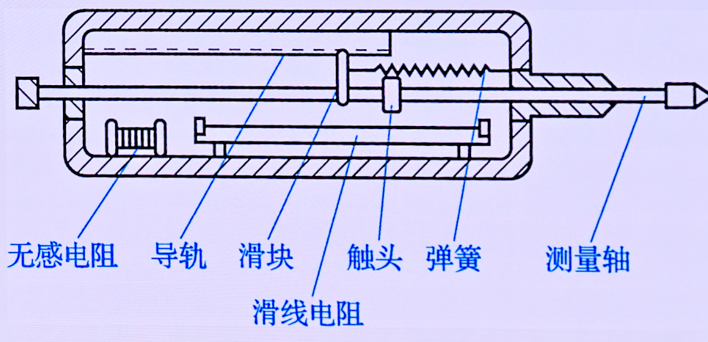  
*图4-4  直线型电位器式位移传感器的外形和结构*  
图4-5所示为直线型电位器式位移传感器的工作原理，触头滑动距离 *x* 可由电压值求得，即 *x=(V0/V1)L* ，式中，*L*为触头最大滑动距离；*V1*为输入电压，*V0*为输出电压  
 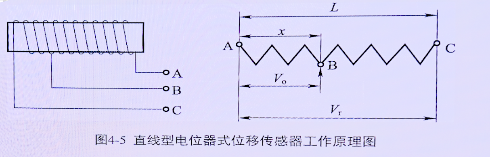  
*图4-5  直线型电位器式位移传感器*  
(2). 旋转型电位器式位移传感器  
旋转型电位器式位移传感器分为单圈电位器和多圈电位器两种，前者的测量范围小于360°，对分辨率也有限制；后者有更大的工作范围及更高的分辨率。  
如图4-6所示，单圈旋转型电位器的电阻元件为圆弧状，滑动触头在电阻元件上做圆周运动。当滑动触头旋转θ角时，触头与滑线电阻端的电阻值和输出电压值也会发生变化
 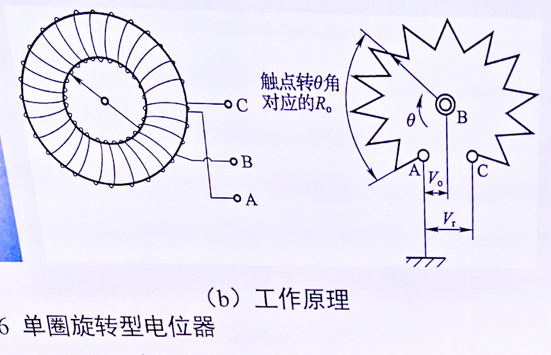  
*图4-6  单圈旋转型电位器*  
2. 光电编码器
光电编码器是一种通过光电转换将输出轴上的直线位移或角度变化转换成脉冲或数字量的传感器，属于非接触式传感器，它主要由码盘、机械部件、检测光栅和光电检测装置（光源、光敏器件、信号转换电路）等组成，如图4-7所示   
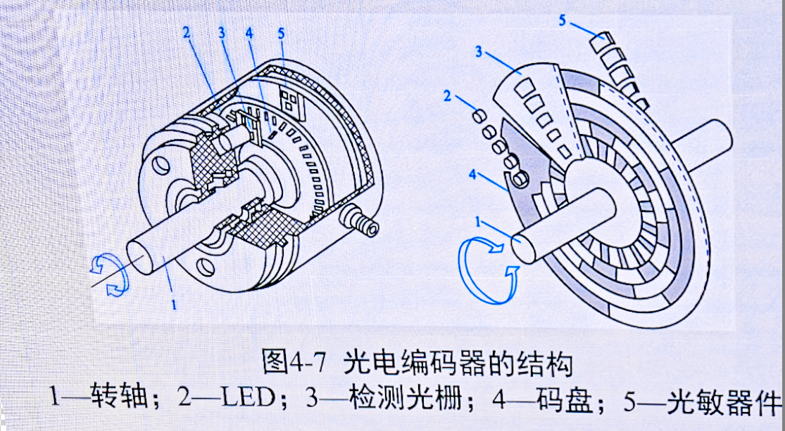  
*图4-7  光电编码器*  
其中，码盘分为透光区和不透光区。如图4-8所示，当光线透过码盘的透光区时，光敏元件导通，产生电流 *I* ，输出端电压 *V0* 为高电平，有 *V0=RI* 当光线照射到码盘的不透光区时，光敏元件不导通，则输出电压为低电平  
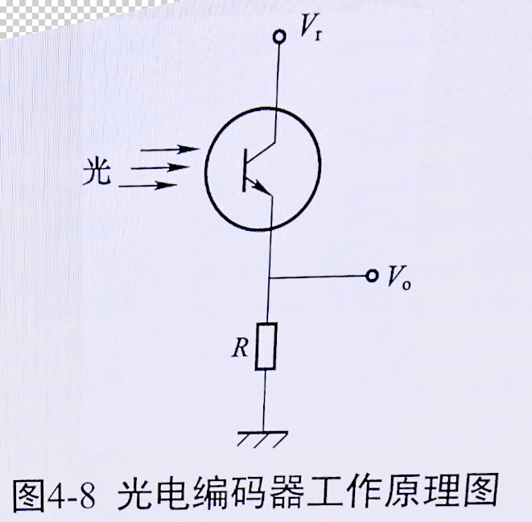  
*图4-8  光电编码器工作原理*  
根据码盘上透光区域与不透光区域的分布不同，光电编码器又可以分为相对式（增量式）和绝对式两种类型  
（1）. 绝对式光电编码器  
如图4-11所示，绝对式光电编码器的圆盘上有沿径向分布的若干同心圆，称为码道，一个光敏元件对准一个码道。  
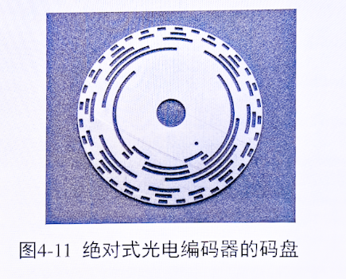  
*图4-11  绝对式光电编码器的码盘*  
若码盘上的透光区对应二进制1，不透光区对应二进制0，则沿码盘径向，由外向内，可依次读出码道上的二进制数，如图4-12所示  
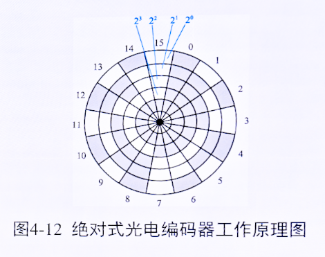  
*图4-12  绝对式光电编码器工作原理*  
（2）. 相对式光电编码器（速度测量）  
相对式光电编码器作为速度传感器时，有模拟和数字两种测量方式  
Ⅰ.模拟方式  
在模拟方式下，必须有一个频率/电压(F/V)变换器，用来将编码器测得的脉冲频率转换成与速度成正比的模拟电压，其原理如图4-14所示。F/V变换器必须有良好的零输入、零输出特性和较小的温度漂移才能满足测试要求  
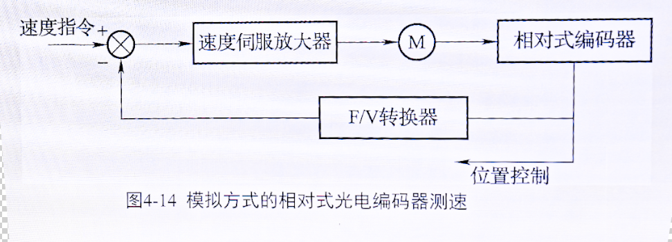  
*图4-14  模拟方式的相对光电编码器测速*  
Ⅱ.数字方式  
数字方式测速是利用数学方式通过计算软件计算出速度。角速度是转角对时间的一阶导数，编码器在时间 *Δt* 内的平均转速为 *ω=Δθ/Δt* ，单位时间越小，则所求得的转速越接近瞬时转速，然而时间太短，编码器通过的脉冲数太少，会导致所得到的速度分辨率下降  

#### 1.2.2 速度传感器

1. 测速发电机
测速发电机是一种模拟式速度传感器，它实际上是一台小型永磁式直流发电机，其结构原理如图4-13所示。当通过线圈的磁通量恒定时，位于磁场中的线圈旋转使线圈两端产生的电压*u*（感应电动势）与线圈（转子）的转速 *ω* 成正比，即 *u=Aω* 式中，*A*为常数。  
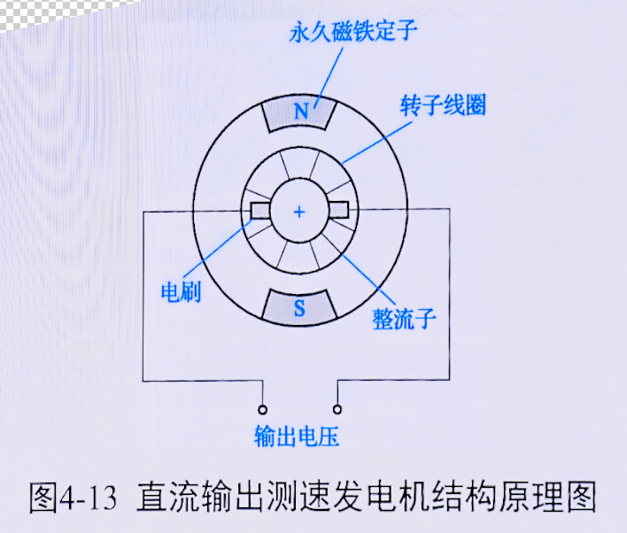  
*图4-13  直流测速发电机工作原理*  
测速发电机的转子与工业设备关节伺服驱动电动机相连便能测出机器人运动过程中的关节转动速度，并能在机器人速度闭环系统中作为速度反馈元件。测速发电机具有线性度好、灵敏度高、输出信号强等优点

#### 1.2.3 力觉传感器

力觉传感器又称力或力矩传感器，是用来检测工业设备的臂部和腕部所产生的力或其所受反力的传感器  
力觉传感器是工业设备重要的传感器种类之一，机器人机体上一般常安装有以下三种类型的力觉传感器：  
（1）. 装在关节驱动器上的力传感器称为关节力传感器，它用于控制中的力反馈  
（2）. 装在末端执行器和机器人最后一个关节之间的力传感器称为腕力传感器  
（3）. 装在机器人手指上的力传感器称为指力传感器  

### 1.3 工业设备外部传感器

#### 1.3.1 接触觉传感器

1. 接触觉传感器概述  
（1）. 接触觉传感器的定义及类型  
接触觉传感器是判断工业设备是否接触物体的测量传感器，可以感知工业设备与周围障碍物的接近程度。接触觉传感器按接触方式的不同，可分为开关式、面接触式和触须式三种  
（2）. 接触觉传感器的作用  
接触觉传感器在工业设备中有以下几方面的作用：感知操作手指与对象物之间的作用力，使手指动作适当；识别操作物的大小、形状、质量及硬度等；躲避危险，以防碰撞障碍物引起事故  
（3）. 接触觉阵列原理
如图4-17所示，电极与柔性导电材料（条形导电橡胶、PVF2薄膜）保持电气接触，导电材料的电阻随压力而变化。当物体压在其表面时，将引起局部变形，测出连续的电压变化，便可测量局部变形。电阻的改变很容易转换成电信号，其幅值正比于施加在材料表面上某一点的力  
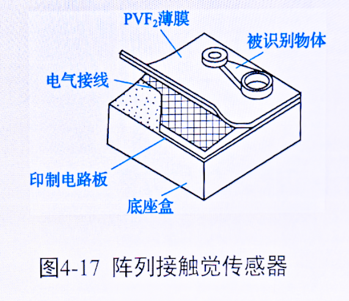  
*图4-17  接触觉阵列传感器*  
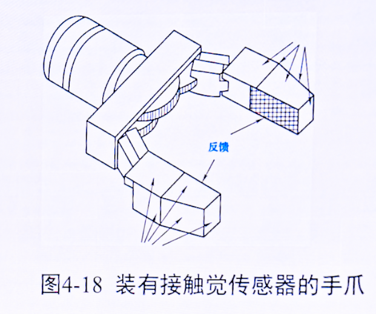  
*图4-18  装有接触觉传感器的手爪*  
2. 开关式接触觉传感器
开关式接触觉传感器外形尺寸较大，空间分辨率较低。开关式接触觉传感器主要分为微动开关和限位开关两种。微动开关即使用很小的力也能动作，其多采用杠杆原理；限定开关是限制工作机构位置的电路，主要用于限定工业设备的动作范围。  
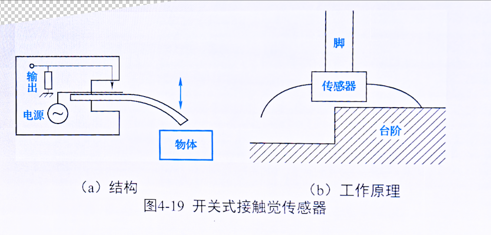  
*图4-19  开关式接触觉传感器*  
3. 面接触式触觉传感器
面接触式触觉传感器即接触觉阵列，将接触觉阵列的电极或光电开关应用于工业设备末端执行器的前端及内外侧面，或应用于相当于人类手掌心的位置，传感器通过识别末端执行器上接触物体的位置，可使末端执行器接近物体并且准确地完成夹持动作  
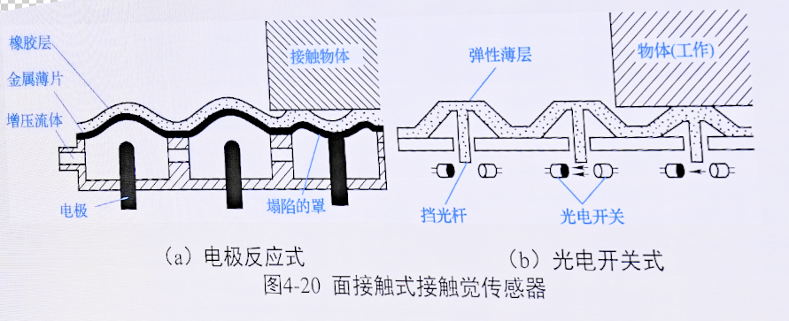  
*图4-20  面接触式接触觉传感器*  
4. 触须式接触觉传感器
触须式接触觉传感器由须状触头及其检测部分构成，触头由具有一定长度的肉空软条丝构成，它与物体接触所产生的弯曲由在根部的检测单元检测。与昆虫的触角一样，触须式传感器的功能是识别接近的物体，确认所设定的动作结束，以及根据接触发出回避动作的指令或搜索对象物的存在  
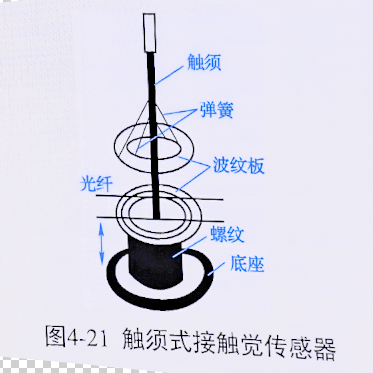  
*图4-21  触须式接触觉传感器*  

#### 1.3.2 滑觉传感器

滑觉传感器是一种用来检测工业设备与抓握对象间滑移程度的传感器。目前常用的滑觉传感器有滚轮式、球式和振动式等类型  
1. 滚轮式滑觉传感器
滚轮式滑觉传感器由一个圆柱滚轮测头和弹簧板支撑组成，如图4-22所示。当工件滑动时，圆柱滚轮测头也随之转动，发出脉冲信号，脉冲信号的频率反映了滑移速度，个数对应滑移的距离
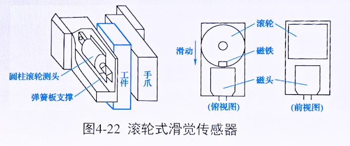  
*图4-22  滚轮式滑觉传感器*  
2. 球式滑觉传感器
球式滑觉传感器体积小，检测灵敏度高。球与被夹持物体相接触，无论滑动方向如何，只要球一转动，传感器便会产生脉冲输出，该球体在冲击力作用下不转动，因此球式滑觉传感器的抗干扰能力较强
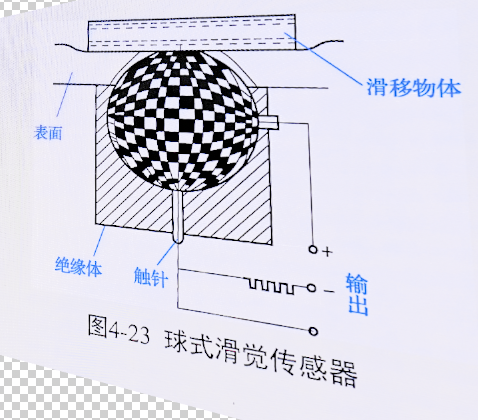  
*图4-23  球式滑觉传感器*  
3. 振动式滑觉传感器
振动式滑觉传感器通过检测滑动时的微小振动来检测滑动。如图4-24所示，钢球指针与被夹持物体接触，若工件滑动，则指针振动，线圈输出信号。  
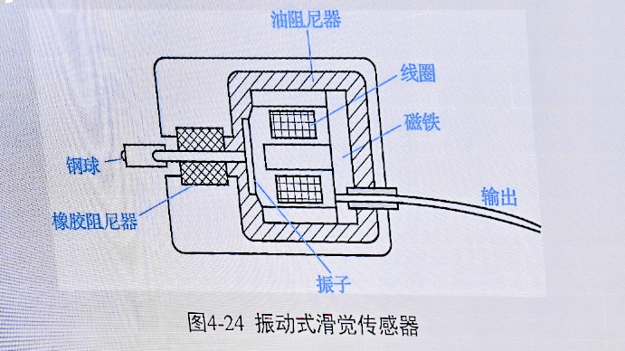  
*图4-24  振动式滑觉传感器*  

#### 1.3.3 接近觉传感器

接近觉传感器是工业设备用来探测自身与周围物体之间相对位置或距离的一种传感器，它探测的距离一般在几毫米到十几厘米之间。接近觉传感器按照转换原理的不同，可分为电涡流式、光纤式和超声波式等类型  
1. 电涡流式接近觉传感器
当导体在一个不均匀的磁场中运动或处于一个交变磁场中时，其内部便会产生感应电流。这种感应电流称为电涡流，这一现象称为电涡流现象，电涡流式接近觉传感器便是利用这一原理制作的
电涡流式接近觉传感器外形尺寸小、价格低廉、可靠性高、抗干扰能力强，而且检测精度也高，能够检测到0.02mm的微量位移。但是电涡流式接近觉传感器检测距离短，一般只能检测到13mm以内，且只能检测固态导体
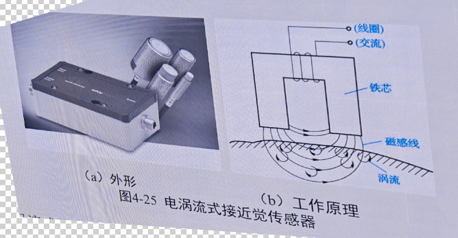  
*图4-25  电涡流式接近觉传感器*  
2. 光纤式接近觉传感器
用光纤制作的接近觉传感器具有抗电磁干扰强、灵敏度高、响应快、检测距离较远等特点  
光纤式接近觉传感器有三种不同的形式，如图4-26所示
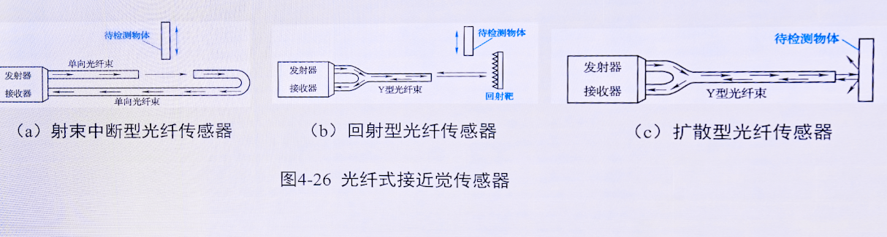  
*图4-26  光纤式接近觉传感器*  
3. 超声波式接近觉传感器
超声波式接近觉传感器通过超声波测量距离。如图4-27所示，传感器由超声波发射器、超声波接收器、定时电路和控制电路等组成。其被测距离有 L=VT/2 
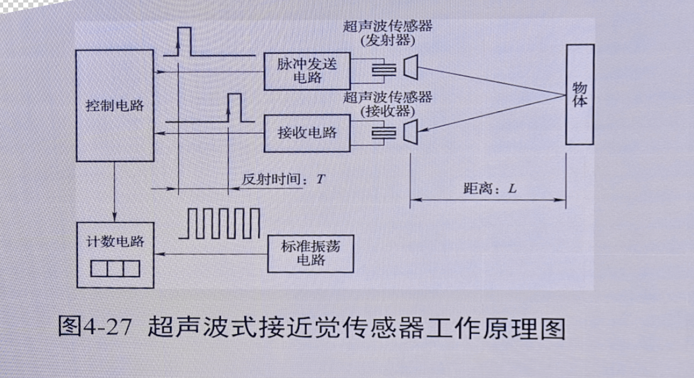  
*图4-27  超声波式接近觉传感器*  

#### 1.3.4 视觉传感器

1. 视觉传感器概述
视觉传感器又称摄像管，它是采用光电转换原理摄取平面光学图像，并使其转换为电子图像信号的器件  
视觉传感器必须具备两个作用：一是将光信号转换为电信号；二是将平面图像上的像素进行点阵取样，并把这些像素按时间取出  
视觉传感器在工业设备中的应用类型大致可以分为三类，即视觉检验、视觉引导和控制过程；其应用领域包括电子工业、汽车工业、航空工业以及食品和制药等  
2. 光导摄像管
3. CCD传感器
